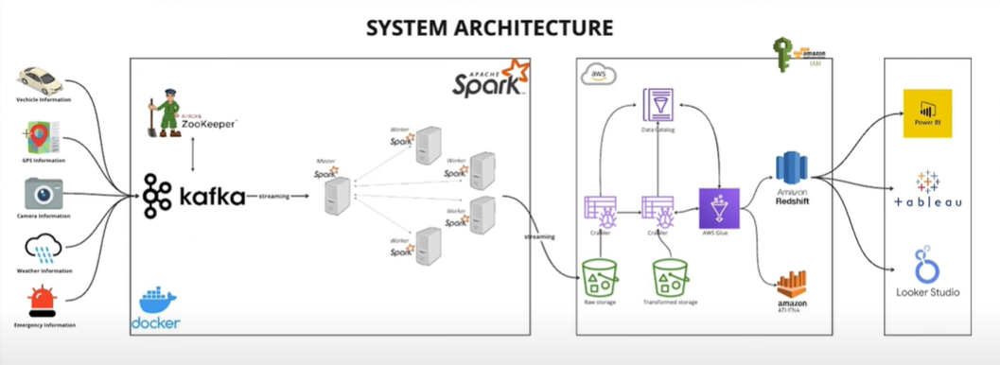

# Streaming Data Pipeline

## Overview
This repository contains the implementation of a streaming data pipeline that ingests mock sensor data into Kafka topics, processes it using Apache Spark Structured Streaming, and stores the results in Amazon S3 for further analysis. The architecture also supports data visualization using tools like Tableau, Power BI, and Looker Studio.



## Features
- Mock sensor data generation for vehicles, GPS, traffic cameras, weather, and emergency information.
- Data streaming into Kafka topics.
- Real-time data processing with Apache Spark.
- Data storage in Amazon S3 in raw and transformed formats.
- Integration with Amazon Redshift, Athena, and Glue for querying and visualization.
- Docker-compose setup for Kafka and Spark.

## Architecture
Refer to the architecture diagram for a visual representation of the system.

## Getting Started

### Prerequisites
- Docker and Docker Compose
- Python 3.x
- Kafka and Spark setup (via Docker Compose)
- AWS account (S3, Glue, Redshift, IAM roles configured)

### Installation
1. Clone the repository:
   ```bash
   git clone https://github.com/your-repo-name.git
   cd your-repo-name
   ```

2. Install dependencies:
   ```bash
   pip install -r requirements.txt
   ```

3. Set up environment variables in a `.env` file:
   ```
   KAFKA_BOOTSTRAP_SERVERS=localhost:9092
   VEHICLE_TOPIC=vehicle_data
   GPS_TOPIC=gps_data
   TRAFFIC_TOPIC=traffic_data
   WEATHER_TOPIC=weather_data
   EMERGENCY_TOPIC=emergency_data
   ```

4. Start the Kafka and Spark environment using Docker Compose:
   ```bash
   docker-compose up
   ```

### Running the Pipeline
1. Generate mock sensor data and produce it to Kafka topics:
   ```bash
   python main.py
   ```

2. Submit Spark jobs to process the Kafka streams and write to S3.

3. Query the data stored in S3 using Amazon Athena or visualize it using Tableau, Power BI, or Looker Studio.

## Files
- `jobs/main.py`: Script to generate mock sensor data and produce it to Kafka.
- `docker-compose.yml`: Configuration for Docker Compose to run Kafka and Spark.
- `jobs/spark-city.py`: Contains Spark Structured Streaming jobs.

## Credits

This project was inspired by the tutorial from @CodeWithYu (https://www.youtube.com/watch?v=Vv_fvwF41_0).  
- Thank you to @CodeWithYu for their amazing tutorial on Kafka and Spark.

## License
This project is licensed under the MIT License. See the LICENSE file for details.